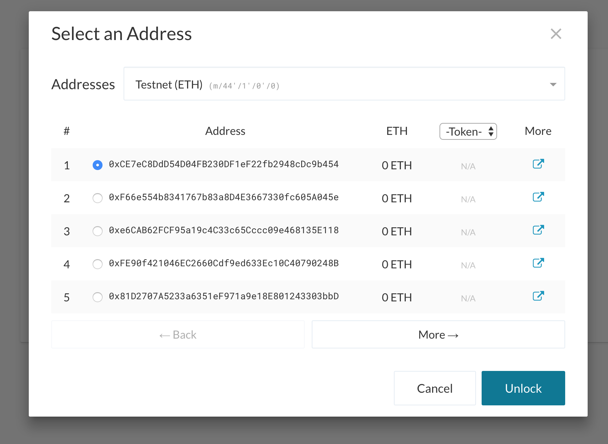
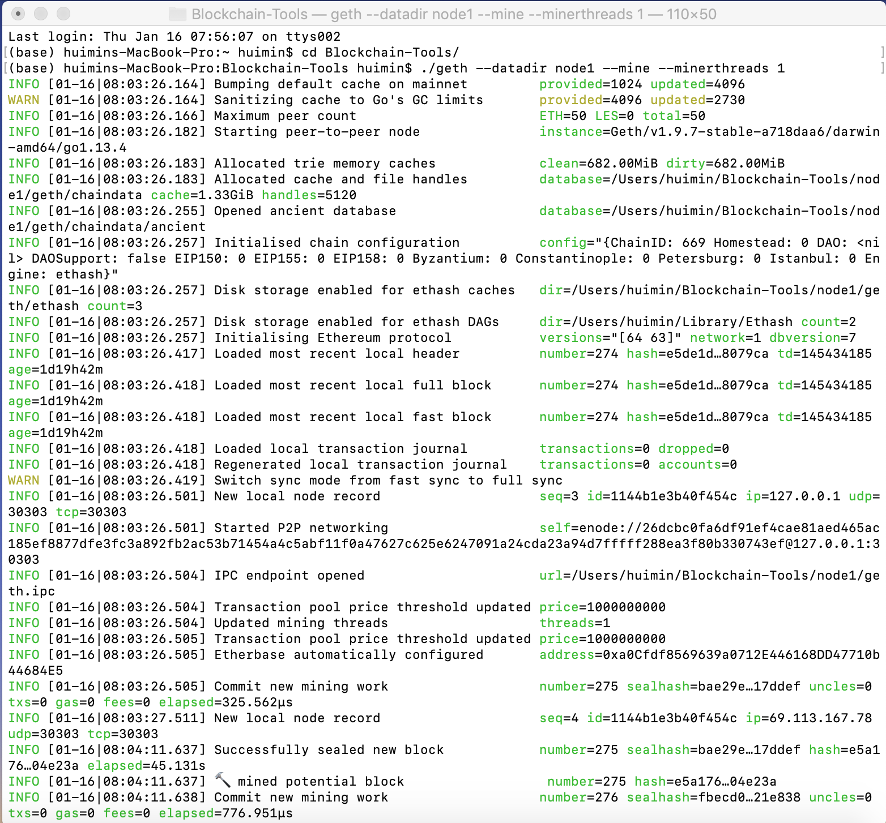
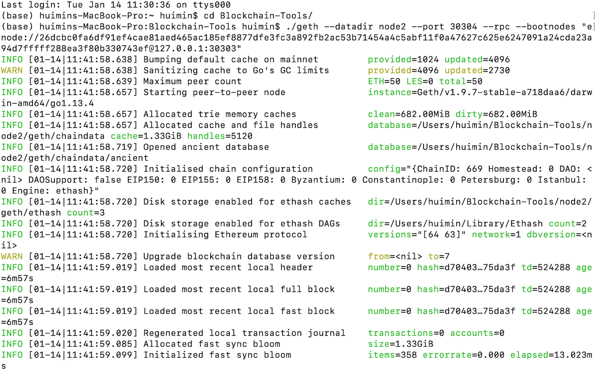
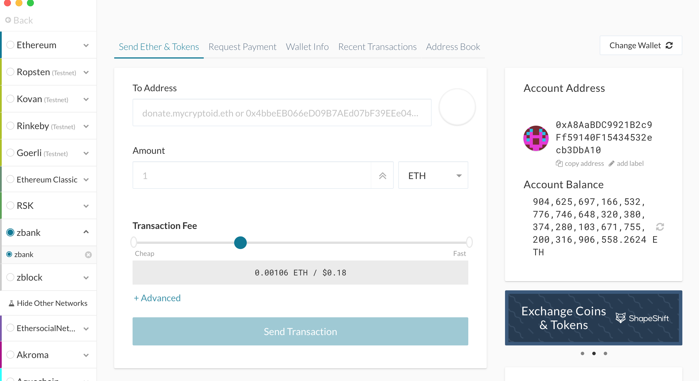
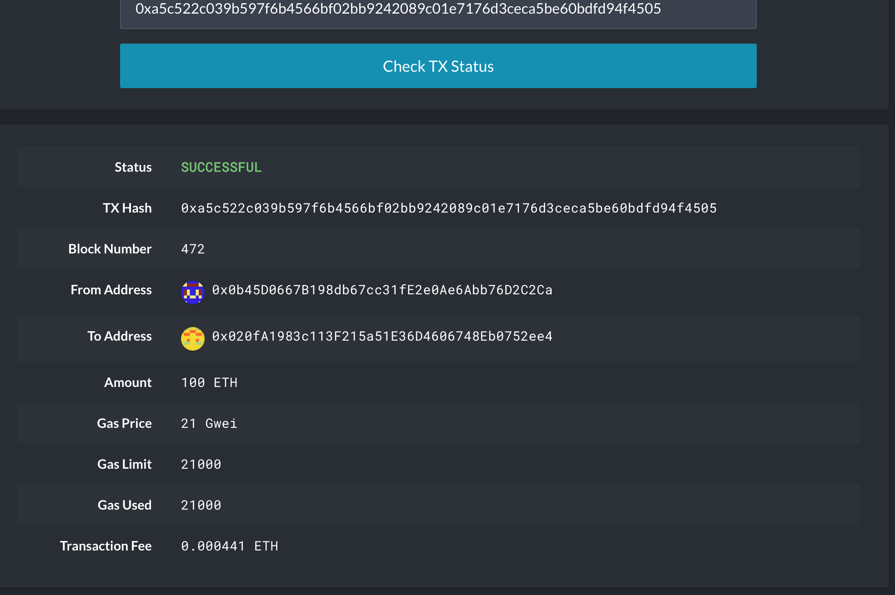
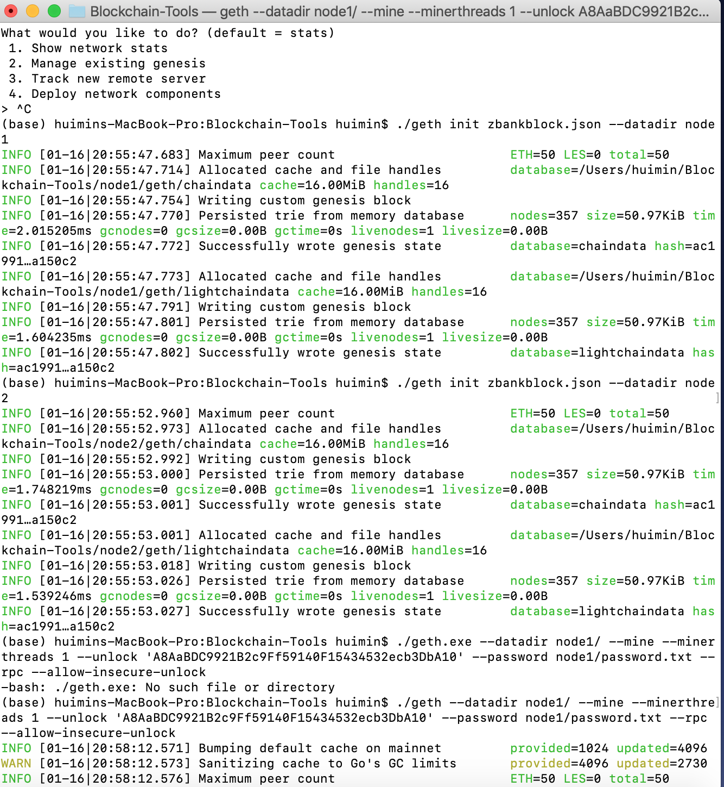
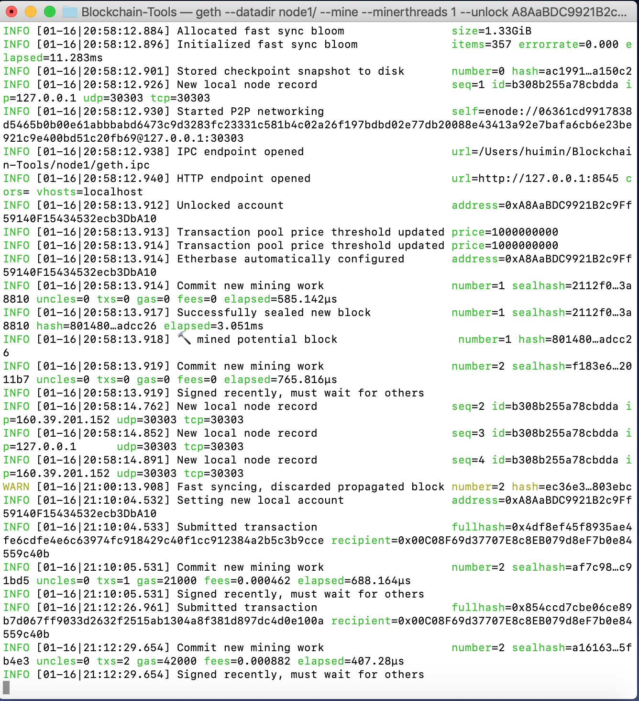
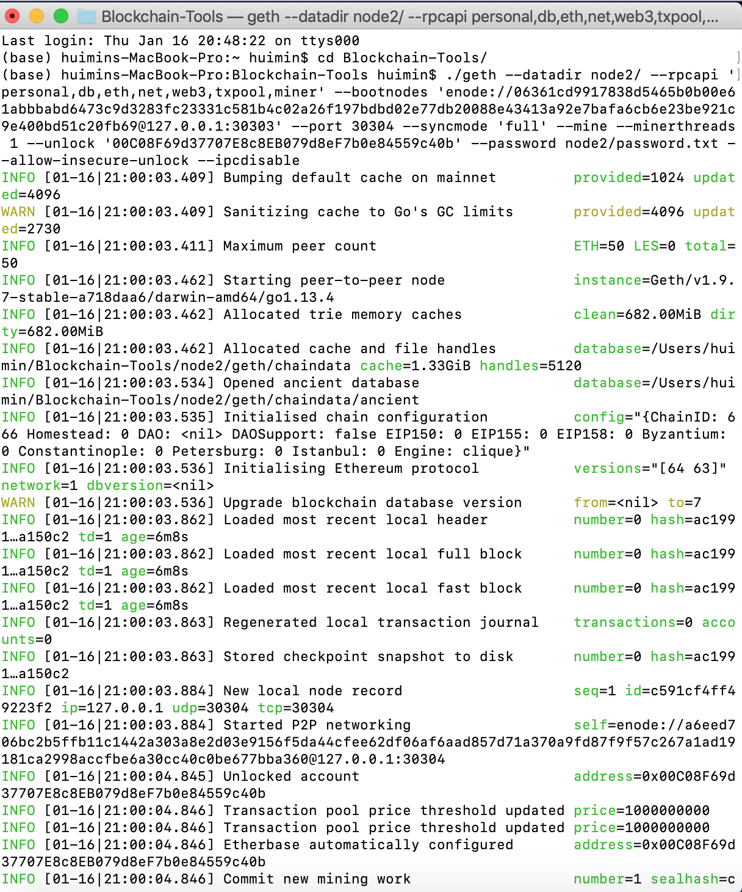
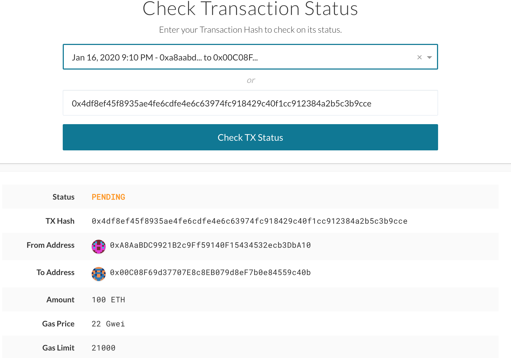

# ZBLOCK CHAIN USING PoW

### Installations:
- Go Ethereum  [Go Ethereum](https://geth.ethereum.org/)
- MyCrypto Desktop App  [MyCrypto](https://www.mycrypto.com/)

Go Ethereum: Is a implementation of the Ethereum protocol that contains tools to create our own blockchain.

MyCrypto: Is an open-source client-site tool for generating ether wallets and allowing you to interact directly with the blockchain. 

### How to Get Your Addresses In MyCrypto

1. In MyCrypto, click on Change Network (Bottom left side)
2. Choose Kovan as your network 
3. Enter your mnemonic phrase to unlock the first address

- You can get your private key for the chosen address. The private key will allow you to sign and authorize transactons. 



### Create A Private Chain 

#### Part I: 

1. Through a terminal window (GitBash in Windows), navigate to the Go Ethereum folder. 
2. Type the following command: 

```bash
./puppeth
``` 
        
        *Note: PUPPETH is a CLI wizard that aids in 
        creating a new ETH network*

3. Name your network. In my case: zblock
4. Select option '2. Configure new genesis', and the option '1. Create new genesis from scrath'.
5. Select option '1. Proof of Work'.
6. In the next step, need to pass one or more addresses that are associated with the cloud mnemonic created in the previous part. These are the addresses you want to pre-fund.
7. Hit enter for the pre-fund option. By default, the addresses will be pre-funded with 1 wei. 
8. Input a 'CHAIN ID' that you like, preferable a three digit one. In my case, is '669'

        *CHAIN ID: is a blockchain setting that affects the forming of an address. The linkage in the transaction binary format between the address and chain ID makes it impossible to move transactions between different blockchain networks.*

9. Next, select '2. Manage exising genesis'. Then, type '2' for Export genesis configurations


> ***From there, you will see four different json files like below picture.***


10. Hit enter, then CLTl + C to exit. 

> ***Theses screeshots show steps 1-10.***


#### Part 2:


        *GETH: is the main Ethereum command line interface client. It is the entry point into the Ethereum network, capable of running as a full node, achiive node, or a light node.*

11. Create nodes. Execute the following command:

```bash
./geth account new --datadir node1
```

12. Set password for "node1" 
13. For node2, repeat the same steps 
14. Now, need to initialize the nodes --> zblock.json is the name of your network.

```bash
./geth init zblock.json --datadir node1
./geth init zblock.json --datadir node2
```


- You can also see the public key for each of the note is there. Using the public key, people can send you cryptocurrency to your address.

#### Part 3 - Mining the blocks:

15. Start mining node1 by executing the following command:
```bash
./geth --datadir node1 --mine --minerthreads 1
```


- This picture shows node1 mining


16. Then, open a new terminal to mine node 2. Execute the following command:

```bash
  ./geth --datadir node2 --port 30304 --rpc --bootnodes "PASTE YOUR ENODE HERE FROM NODE1"
```
- This command allows both nodes to be sycronized 



#### Execute Transactions on The Chain

First you need to create a new network for your chain. 

17. Go to 'Change Network' again. Select add custom node.
18. Fill out the information to set up your custom node.
19. Once the new network is set up. Proceed to sign in to that network. (See below image)



* To proof if the blockchain is working, send a transaction from node1 (zbank) to node 2. Example below: 




# PS

I was able to create a PoA network, and both node1 and node2 were mining. However, when I tried to perform a transaction in MyCrypto wallet, my transaction from node1 to node2 was never completed. It kept showing it is pending. 

I am attaching the images of my work for Proof of Authority. 







